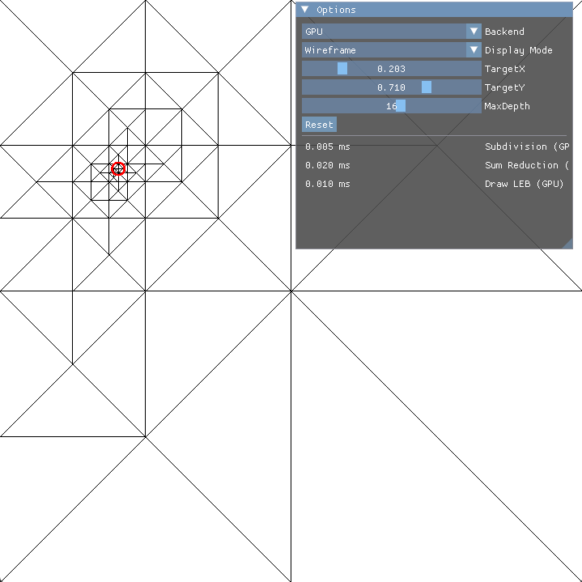

# Concurrent Binary Trees
This is a port of the [subdivision example](https://github.com/jdupuy/LongestEdgeBisection2D/) of the [CBT](https://github.com/jdupuy/libcbt/) and [LEB](https://github.com/jdupuy/libleb) libraries. The purpose of this repo is to demonstrate usage of the HLSL library (which has slightly differing functionality from the original C++/GLSL libraries).

It is implemented using NVIDIA's [Donut](https://github.com/NVIDIA-RTX/Donut) framework and can run on both DirectX12 and Vulkan.

## Build
1. Clone the repository with all submodules:

    `git clone --recrusive https://github.com/jambuttenshaw/cbt`

    If you did not clone recursively, then run

    `git submodule update --init --recursive`
2. Inside `cbt` create a build directory and move to that directory:

    `cd build && mkdir build`
3. Run CMake to generate a visual studio `.sln`

    `cmake ..`
4. Open `cbt.sln` and build the solution.
## Usage
To run the project, set the startup project to CBT and run. 

Command line arguments can be used to specify the graphics API (`-dx12` or `-vk`).
